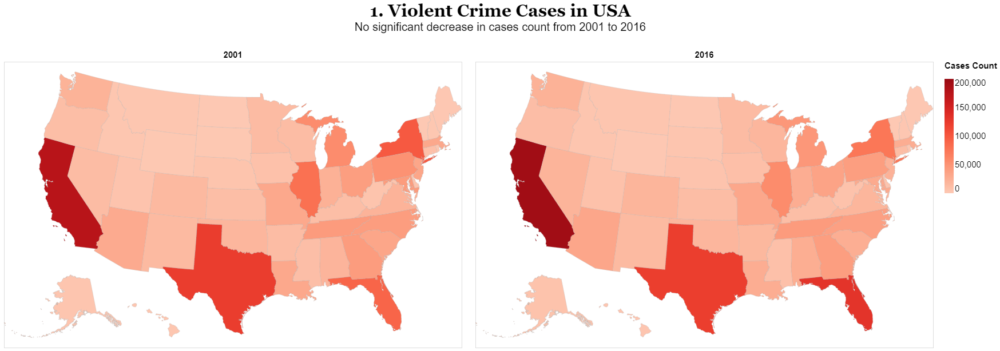
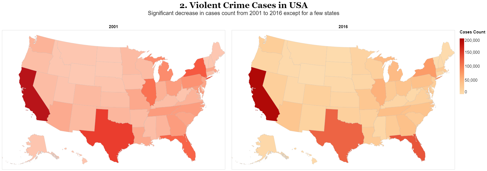

As visualizations increasingly play a role in how the general public consumes news and information, it is important to realize how a visualization design may influence what a viewer concludes and remembers about the data. In this assignment, you will identify a dataset of interest and design two static visualizations to communicate the data. One design will be an earnest representation of the data, whereas the other will be a deceptive visualization that aims to mislead the viewer. For this second image, the design challenge is to mislead without using obvious distortions or omissions.

# Task
Your task is to design two static (single image) visualizations of your chosen dataset. One visualization should aim to effectively and earnestly communicate insights about the data, whereas the other visualization design should aim to mislead the viewer into drawing the wrong conclusions. You will also provide a short write-up (no more than 4 paragraphs) describing your design rationale for both visualizations.

For this assignment, we will consider an earnest visualization to be one where:

* The visualization is clear and interpretable by the general population
* The visual encodings are appropriate and effective for the intended task
* Data transformations are clearly and transparently communicated
* The underlying data source (and any potential bias) is clearly communicated

On the other hand, a deceptive visualization may exhibit the following properties:

* The visual representation is intentionally inappropriate or misleading
* Titles are skewed to intentionally influence the viewer's perception
* The data has been transformed or filtered in an intentionally misleading way
* The existence or source of bias in the underlying data is unclear
# Visualizations
Try to find which is true and which is deceptive...

The first plot with the title `1. Violent Crime Cases in USA` is an earnest visualization and `2. Violent Crime Cases in USA` is a deceptive visualization.
# Explanation
I chose a *Crime and Incarceration in the United States* study dataset from Kaggle available at [link](https://www.kaggle.com/datasets/christophercorrea/prisoners-and-crime-in-united-states). The dataset contains 16 different features such as State, Prisoner Count, Type of Crime, etc from 2001 to 2016. I wanted to know **Is there a decrease in violent crime cases in U.S. states from 2001 to 2016?**.

## Dataset Preparation
I filtered out only `State`, `Year`, and `Violent Crime Count` from the dataset. Since I am only interested in 2001 and 2016, I extracted State and Crime Counts for both years into separate data frames. Geospatial visualization would be ideal to have a quick glance at crime cases in U.S. states for both years. Also, my question is a Yes/No type and I don't need an exact increase or decrease in cases, so I am not going for a line plot (it would have been messy with the `State` feature).

## Design
For the base map, I used a TopoJSON file from Vega-lite datasets for the United States at 10m resolution, containing features for states. However, the crime cases dataset does not include the latitude and longitude locations of the state. To augment the crime cases data with locations, I did a data transformation called `lookup`. The lookup transform takes a field value in a primary dataset and uses it as a key to look up related information in another table. I added an extra `id` column with numbers assigned to each state. I used the `albersUsa` projection as my dataset has even non-contiguous states of Alaska and Hawaii. I used color encoding for the `violent cases count` with a custom domain of `[0,200000]` for a better view of the legend. I went for a Choropleth Map even though the encoding is quantitative because I only need to see the difference in years so I added a Trellis plot (horizontal concatenation) dividing years 2001 and 2016. I chose the color scheme of `reds` as a symbolic color for criminal cases. Other extra design includes adding individual titles for charts and a common title and subtitle. I also changed font style, size, offset, and padding for titles and legend.

## Deception
One can transform data or change data or do quite a large number of operations to make deceptive visualization look real. But I want to show how easy to make a strong deceptive visualization with just one operation and show how easy it is to trick people. When I plotted the actual data with the above-mentioned design steps, I found there is no significant decrease in the case count in from 2001 to 2016. One can make that conclusion from the color comparison. So to make a deceptive visualization, I decided to tweak the color aspect of the map. I went with the same color scheme of `reds` for the year 2001 but chose the `orangered` scheme for the year 2016. I concatenated both maps and removed the legend for the year 2001. This gives the impression that both maps have the same legend but in reality, both maps have an independent color scale. Just the change of color scheme gives entirely different insights from the visualization.
