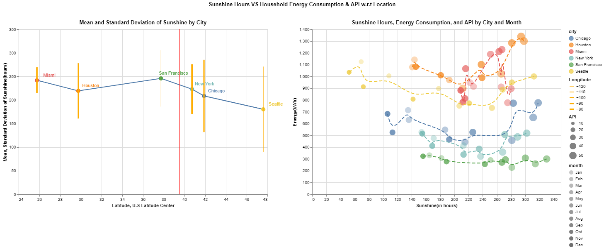

# Static Visualization Design
## Problem Statement
Your task is to design a static (i.e., single image) visualization that you believe effectively communicates the data and provide a short write-up (no more than 4 paragraphs) describing your design. Start by choosing a question you'd like your visualization to answer. Design your visualization to answer that question, and use the question as the title of your graphic.
## Data Set
The climate of a place can have a tremendous impact on people's lived experience, ranging from personal moods to how an entire region defines itself. Here, you will examine a set of average monthly climate measurements for six major U.S. cities, roughly covering the edges of the continental United States. The updated dataset is in [link](sunshine.csv).

### Extra Info:
On the assignment web page, it is said that the climate of a place can have a tremendous impact. But the data contains only the sunshine hours of cities. So I searched for additional monthly data on the given 6 cities. I found household energy consumption in kWh from U.S Energy Information Agency and Air Pollution Index (API) from Environmental Protection Agency.

## Question:
How do sunshine hours affect Energy consumption and API with respect to location?
## Final Plot

## Plan of Action:
My goal is not just to show how the sunshine influences energy and API but also how the influence change with respect to location. In process of doing this, I want to get as many insights as possible. So I decided to reach the goal in three steps.
1. Visualize 'Location vs Sunshine' hours first
2. Then examine 'Sunshine vs Energy, API'
3. Draw conclusions from both plots.

### Step 1 (Location vs Sunshine)
The idea is to see how the location (latitude, longitude), a quantitative field related to the number of sunshine hours, is another quantitative field. According to Mackinlay's ranking, the position is highly ranked for quantitative fields. I want to go for a 2D plot but I have 3 fields so I made an assumption using general knowledge that 'latitudes predominantly determine the amount of sunlight'. So, I chose latitude for X-axis (the longitude part is explained later). For Y-axis, I chose the mean of sunshine hours over the entire year. As both X and Y axis are quantitative fields and Y-axis is an aggregate value, I chose to mark them as a line. For cities that are nominal fields, I chose Hue/color as per ranking and added them as points over their respective latitudes. Added labels as a text for effectiveness. I felt that just mean doesn't describe the pattern of sunshine in a city so I went for an error bar with standard deviation to see how sunshine varies in a city over a year. Since I didn't use longitude, I represented it using the stroke width of the error bar. For effectiveness in dividing northern cities from southern cities, I added a rule at the 39.5 latitudes as it is the center of the U.S.

#### Insights from plot1:
We can confirm our assumption that latitudes affect sunshine hours and longitudes don't. Mean sunshine hours tend to decrease as latitude increases. Also, not so evident but the standard deviation of sunshine hours tend to increase as latitude increase which means northern cities have varying sunshine hours throughout the year and southern cities have consistent sunshine hours.

### Step 2(Sunshine vs Energy, API)
I already used 'color' for cities in the previous plot. I have enough information about location vs sunshine from the previous plot so ignoring location. Here Sunshine affects the other parameters so chose X-axis for sunshine (In the previous plot location affects sunshine, so location in X-axis). For Y-axis, I can choose API or Energy Consumption. But I chose Energycnsumption as the values are too different between cities thus dividing values into bands (size/opacity) won't be effective. Only the axis can give proper visualization for values in a large range. I went for circle marks as I am not doing any aggregations. For API, I went with the next available in ranking for the quantitative field which is shape(area/volume) and API values are not too varying and are in a small range. Instead of going with mean values of sunshine over a year, I didn't choose any aggregations for more insights with respect to months. I went for opacity for months as it is the only one left. Also, I sorted the months chronologically.

#### Insights from plot2:
API and sunshine hours are clearly linearly correlated. See the increase in the size of the circle from left to right for individual cities. As the sunshine hours increase, API is also increasing for every city. This might be due to sunlight breaking down Ozone molecules thus increasing API or maybe forest fires (but API is not so high). Also if we look closely at opacity, most of the city points are grouped with high and low opacity. Which means the distribution of sunlight hours over months is bell-shaped. Jan and Dec, Feb and Mar, .. are closely grouped in sunshine hours meaning that sunshine hours are more in summers compared to winters.
Energy consumption is not so clear. But if you see closely there is a kind of small parabola(U) shape from one to other end. I chose basis interpolation to show this. Except for Miami, all other cities show this shape. That is at both extremes of sunlight hours electricity consumption is more. This might be due to heaters in winter and air conditioning in summer.

### Step 3 (Overall Insights)
Clearly, API and energy consumption are affected by sunshine hours, but coming back to the question, is there any effect due to the location too?

API values are in the order of Seattle, San Francisco, Chicago, New York, Miami, and Houston. A bit off but northern cities with less consistent sunshine tend to have lower APIs. But there is no strong relation between API, and sunshine hours w.r.t location.

San Francisco, New York, and Chicago are at the lower end of energy consumption but there is no common relation between these cities in terms of sunlight hours except that they are close in latitudes but the same can't be said for other cities. So there might be a lot of other factors influencing energy.
